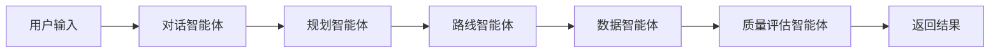

# Travel AI Prototype - 对话式AI旅游规划引擎

基于CAMEL-AI多智能体框架开发的智能旅游规划系统原型，支持自然语言对话、智能路线规划和个性化推荐。

## 🎯 项目概述

这是一个最小可行产品(MVP)，展示了如何使用CAMEL-AI框架构建复杂的多智能体协作系统。系统包含：

- **对话式前端**: React + TypeScript + Ant Design
- **智能后端**: FastAPI + CAMEL-AI + PostgreSQL
- **多智能体协作**: 对话、规划、路线、数据、质量评估智能体
- **实时通信**: WebSocket支持流式对话

## 🏗️ 系统架构

```
前端 (React)  ←→  API网关 (FastAPI)  ←→  CAMEL智能体  ←→  数据存储
     ↓                    ↓                    ↓              ↓
WebSocket通信         RESTful API        多智能体协作      PostgreSQL
                                                           + Redis
                                                           + Qdrant
```

## 🚀 快速开始

### 1. 环境要求

- Docker & Docker Compose
- Node.js 18+ (本地开发)
- Python 3.11+ (本地开发)

### 2. 克隆项目

```bash
git clone <repository-url>
cd travel-ai-prototype
```

### 3. 配置环境

```bash
# 复制环境配置文件
cp env.example .env

# 编辑 .env 文件，填入API密钥
nano .env
```

### 4. 启动开发环境

```bash
# 启动所有服务
docker-compose -f docker-compose.dev.yml up -d

# 查看服务状态
docker-compose -f docker-compose.dev.yml ps
```

### 5. 访问应用

- **前端**: http://localhost:3000
- **后端API**: http://localhost:8000
- **API文档**: http://localhost:8000/docs

### 6. 演示账号

- 用户名: `demo`
- 密码: `demo123`

## 📁 项目结构

```
travel-ai-prototype/
├── frontend/                 # React前端应用
│   ├── src/
│   │   ├── components/       # UI组件
│   │   ├── hooks/           # 自定义Hooks
│   │   ├── services/        # API服务
│   │   ├── store/           # 状态管理
│   │   └── types/           # TypeScript类型
│   ├── public/
│   └── package.json
│
├── backend/                  # FastAPI后端服务
│   ├── app/
│   │   ├── api/             # API路由
│   │   ├── core/            # 核心配置
│   │   ├── db/              # 数据库
│   │   ├── models/          # 数据模型
│   │   └── schemas/         # Pydantic模式
│   ├── sql/                 # SQL脚本
│   └── requirements.txt
│
├── camel_agents/            # CAMEL智能体模块
│   ├── agents/              # 智能体实现
│   ├── toolkits/            # 工具包
│   ├── configs/             # 配置
│   └── tests/               # 测试
│
├── docker/                  # Docker配置
├── docs/                    # 项目文档
└── scripts/                 # 辅助脚本
```

## 🤖 智能体架构

### 核心智能体

1. **对话智能体 (ConversationAgent)**
   - 自然语言理解
   - 意图识别和实体提取
   - 多轮对话管理

2. **规划智能体 (PlanningAgent)**
   - 旅行计划生成
   - 个性化推荐
   - 预算估算

3. **路线智能体 (RouteAgent)**
   - 路线优化
   - 交通方式比较
   - 成本时间分析

4. **数据智能体 (DataAgent)**
   - 实时数据获取
   - API集成
   - 数据清洗处理

5. **质量评估智能体 (QualityAgent)**
   - 方案评估
   - 可行性检查
   - 优化建议

### 工作流程



## 🛠️ 开发指南

### 本地开发

```bash
# 后端开发
cd backend
pip install -r requirements.txt
uvicorn app.main:app --reload

# 前端开发
cd frontend
npm install
npm start

# CAMEL智能体开发
cd camel_agents
pip install -r requirements.txt
python -m pytest tests/
```

### 代码质量

```bash
# 后端代码检查
cd backend
black .
isort .
flake8 .
mypy .

# 前端代码检查
cd frontend
npm run lint
npm run type-check
npm run test
```

### 测试

```bash
# 后端测试
cd backend
pytest tests/ -v

# 前端测试
cd frontend
npm test

# 集成测试
docker-compose -f docker-compose.dev.yml exec backend pytest tests/integration/
```

## 🎯 核心功能

### ✅ 已实现功能

- [x] 用户认证和注册
- [x] WebSocket实时对话
- [x] 基础意图识别
- [x] 简单旅行规划
- [x] 路线优化算法
- [x] 多语言支持 (中英文)
- [x] 对话历史存储
- [x] 响应式前端界面

### 🚧 开发中功能

- [ ] 真实CAMEL智能体集成
- [ ] 高级NLP功能
- [ ] 实时API数据集成
- [ ] 复杂路线优化
- [ ] 更多AI模型支持

### 🔮 计划功能

- [ ] 移动端应用
- [ ] 语音交互
- [ ] 图像识别
- [ ] 社交功能
- [ ] 支付集成

## 📊 技术栈

### 前端技术
- **框架**: React 18 + TypeScript
- **状态管理**: Zustand
- **UI组件**: Ant Design
- **构建工具**: Vite
- **网络请求**: Axios + React Query
- **实时通信**: WebSocket

### 后端技术
- **框架**: FastAPI
- **AI框架**: CAMEL-AI
- **数据库**: PostgreSQL + Redis + Qdrant
- **认证**: JWT
- **异步**: asyncio + uvicorn

### AI技术
- **模型**: GPT-4o-mini, Claude-3.5, Gemini-Pro
- **向量存储**: Qdrant
- **自然语言处理**: spaCy
- **路线优化**: NetworkX + SciPy

### 部署技术
- **容器化**: Docker + Docker Compose
- **监控**: Prometheus + Grafana
- **日志**: Structlog
- **安全**: HTTPS + JWT + 数据加密

## 🔧 配置说明

### 环境变量

| 变量名 | 说明 | 默认值 |
|--------|------|--------|
| `OPENAI_API_KEY` | OpenAI API密钥 | 必填 |
| `ANTHROPIC_API_KEY` | Anthropic API密钥 | 可选 |
| `DATABASE_URL` | 数据库连接URL | postgresql://... |
| `REDIS_URL` | Redis连接URL | redis://localhost:6379 |
| `SECRET_KEY` | JWT密钥 | 必填 |

### Docker端口

| 服务 | 端口 | 说明 |
|------|------|------|
| 前端 | 3000 | React开发服务器 |
| 后端 | 8000 | FastAPI应用 |
| PostgreSQL | 5432 | 主数据库 |
| Redis | 6379 | 缓存数据库 |
| Qdrant | 6333 | 向量数据库 |

## 🤝 贡献指南

1. Fork 项目
2. 创建功能分支 (`git checkout -b feature/amazing-feature`)
3. 提交更改 (`git commit -m 'Add amazing feature'`)
4. 推送到分支 (`git push origin feature/amazing-feature`)
5. 开启 Pull Request

## 📝 许可证

此项目采用 MIT 许可证 - 查看 [LICENSE](LICENSE) 文件了解详情。

## 📞 联系方式

- 项目维护者: Travel AI Team
- 邮箱: contact@travel-ai.com
- 文档: [项目文档](./docs/)

## 🙏 致谢

- [CAMEL-AI](https://github.com/camel-ai/camel) - 多智能体框架
- [FastAPI](https://fastapi.tiangolo.com/) - 现代Python API框架
- [React](https://reactjs.org/) - 用户界面库
- [Ant Design](https://ant.design/) - 企业级UI设计语言

---

**开发状态**: 🚧 原型开发中 | **版本**: v1.0.0 | **更新时间**: 2025-08-10
